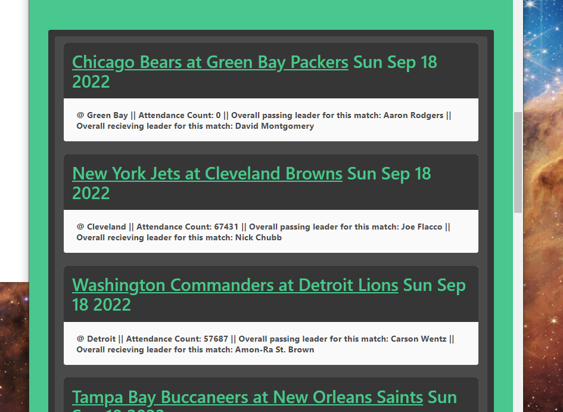

# Group 3 | UCBCS_FFCalculator | README

What motivated us to create this project is that all of us are huge NFL fans. We wanted to develop a web app that correlates to our favorite sport.
This drove us to collaborate and apply our knowledge to this project. Overall experience was challenging and rewarding at the same time. 
The 3 languages we have used for this project are HTML, Javascript, JSON, and CSS. We also used a free open-source framework called Bulma.

* Sky and Braxton were in charge of building and pulling fantasy league data to javascript so that users

* Khiem and Ish were in charge of live twitter feeds where users can check up on latest nfl news for their fantasy league. 


Group 3 Members:

* Braxton Minkey
* Sky Texier
* Ishi Anand
* Khiem Phung

## Acceptance Criteria

You and your group will use everything you’ve learned over the past six weeks to create a real-world front-end application
that you’ll be able to showcase to potential employers. The user story and acceptance criteria will depend on the project 
that you create, but your project must fulfil the following requirements:

```
- Use a CSS framework other than Bootstrap.

- Be deployed to GitHub Pages.

- Be interactive (i.e: accept and respond to user input).

- Use at least two server-side APIs.

- Does not use alerts, confirms, or prompts (use modals).

- Use client-side storage to store persistent data.

- Be responsive.

- Have a polished UI.

- Have a clean repository that meets quality coding standards 
  (file structure, naming conventions, follows best practices for class/id-naming conventions, indentation, quality comments, etc.).

- Have a quality README (with unique name, description, technologies used, screenshot, and link to deployed application).

- Finally, You must add your project to the portfolio that you created in Module 2.
```

## Resources and APIs Used

* CSS Framework - [Bulma](https://bulma.io/)
* Brainstorming - [Excalidraw](https://excalidraw.com/)
* Research - [Stackoverflow](https://stackoverflow.com/)
* API 1 (Main 1) - [SleeperAPI](https://docs.sleeper.app/)
* API 2 (Twitter) - [TwitterAPI](https://www.postman.com/twitter/workspace/twitter-s-public-workspace/request/9956214-c936778b-e343-4a23-b1b4-433c501cf6eb)
* API 3 (NFL News) - [NFL News API](http://site.api.espn.com/apis/site/v2/sports/football/nfl/scoreboard)
* API 4 (NFL Events) - [NFL Events](https://site.api.espn.com/apis/site/v2/sports/football/nfl/news)

## Screenshots


Screenshots follow the order of the code and define sections

Index Screenshots

* Screenshot 1: Blank Homepage
* 
* Screenshot 2: User Welcome Block
* 
* Screenshot 3: User's First Fantasy Football Team
* 
* Screenshot 4: User's Second Fantasy Football Team
* 

Twitter Page Screenshots

* Screenshot 5: Main Page
* 
* Screenshot 6: Single Twitter Section
* 

Index & Twitter Page Responsiveness

* Screenshot 7: Main Page
* 
* Screenshot 8: Twitter Page
* 
* Screenshot 9: NFL News
* 

NFL News Section
* Screenshot 10: NFL News
* 

## Final Project Links

- [Live Github Page](https://brackym.github.io/UCBCS_FFCalculator/)
- [Github Project Repository](https://github.com/BrackyM/UCBCS_FFCalculator)

## Group Members

* Braxton Minkey - [Github](https://github.com/BrackyM)
* Sky Texier - [Github](https://github.com/skytexier)
* Ishi Anand - [Github](https://github.com/ianad389)
* Khiem Phung - [Github](https://github.com/phungxkhiem)